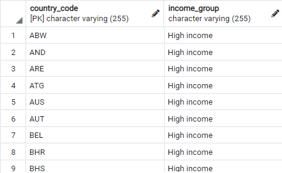
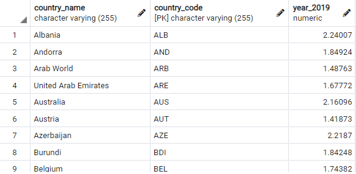
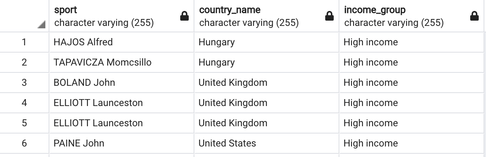
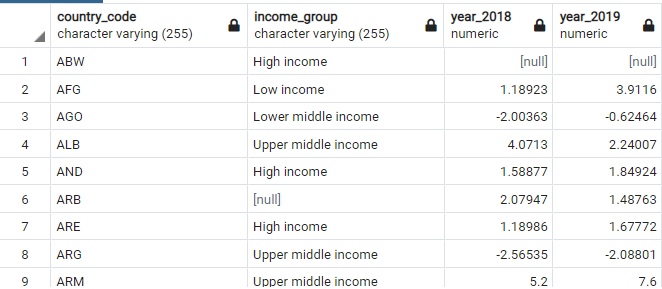

# ETL Project

## Extract
For this project, group Olympians used the following datasets:
* [Olympic Sports and Medals, 1896-2014 (Guardian)](https://www.kaggle.com/the-guardian/olympic-games?select=dictionary.csv) Source: Kaggle

* [Olympic Games Medal Dataset (from 1896 to 2018)](https://www.kaggle.com/rushikeshlavate/olympic-games-medal-datasetfrom-1896-to-2018) Source: Kaggle

* [The World Bank Data: BDP growth (annual %)](https://data.worldbank.org/indicator/NY.GDP.MKTP.KD.ZG?end=1990&most_recent_year_desc=true&start=1990&view=map&year=1961) Source: The World Bank Open Data Source

All of the data sets were originally formatted in CSV files which we read into Jupyter Lab for transformation.

## Transform
Steps for data transformation are listed below for each dataset. Code for the transformations can be found in their corresponding Jupyter notebooks.

### Guardian Transformation
* Add season column (summer or winter) to summer and winter data
* Merge summer and winter data
* Sort combined dataset by year
* Remove commas from Athlete and Event columns

### Medals Transformation
* Split country column from ioc column, put into new df
* Replace original country/code df columns with new df columns
* Strip parentheses from around country code

### World Bank Transformation
* Remove first 4 rows (header)
* Drop columns ‘Indicator Name’, ‘Indicator Code’, ‘1960’, ‘2020’
* Rename columns

### Regional Metadata Transformation
* Rename columns to be able to join with World Bank data

## Load
Our group decided to load our cleaned data into [PostgreSQL](https://www.postgresql.org/) because it is a relational database. Because our data is structured and can be represented in a tabular format with schemas that are clearly defined, a relational database is the best choice for data storage. Each data source can be joined on country code attribute (`world_gdp.country_code`, `regional_info.country_code`, `game_medals.code`, `athlete_medals.country`).

Our final tables include:
* **world_gdp** includes the data from the World Bank Data source (country code, country name, and gdp information for each country from 1961 to 2019)

* **regional_info** includes the metadata from the World Bank Data source (country code, country name, income classification, region, and any special notes about how the GDP for each country was calculated)

* **game_medals** includes the cleaned data from the Kaggle Olympic Games Medal Dataset (from 1896 to 2018) (country name, country code, total bronze, silver, and gold medal counts for the summer and winter olympics for each country, and overall rank of each country based on total number of medals)

* **athlete_medals** included cleaned data from Kaggle Guardian Olympic Sports and Medals, 1896-2014 (olympic year, olympic city, country code, athlete’s name, sport, event, discipline, medal, and gender)

See [schema.sql](schema.sql) for the SQL code to create each table.

### Example Queries
* Filter the `regional_info` table by income type (high income, upper middle income, low income, etc.).
```sql
SELECT regional_info.country_code, regional_info.income_Group 
FROM regional_info 
WHERE regional_info.income_Group = 'High income';
```


* Filter the `world_gdp` table for gdp values in a specific year and between a specific range.
```sql
SELECT country_name, country_code, year_2019 FROM world_gdp
WHERE year_2019 > 0 AND year_2019 < 3;
```


* Join `athlete_medals` data with `regional_info` data.
```sql
SELECT Sport, country_name, income_Group
FROM athlete_medals AS a
JOIN regional_info AS r
ON a.Country = r.country_code;
```


* Join `athlete_medals` data with `world_gdp` data.
```sql
SELECT year_1999 as "GDP growth 1999", country_name, Athlete, Medal
FROM athlete_medals AS a
JOIN world_gdp AS g
ON a.Country = g.country_code;
```

* Join `regional-info` data from World Bank Dataset with GDP data from `world_gdp`.
```sql
SELECT regional_info.country_code, regional_info.income_Group, world_gdp.year_2018, world_gdp.year_2019
FROM world_gdp
INNER JOIN regional_info ON
regional_info.country_code=world_gdp.country_code;
```
